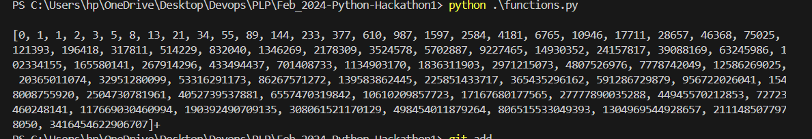
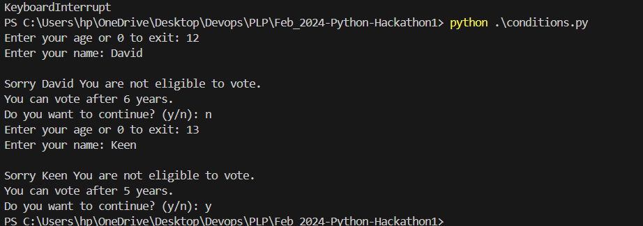

## 1. Functions & Fibonacci Sequence

Write a Python program to generate the Fibonacci sequence up to a specified term n. The Fibonacci sequence starts with 0 and 1, and each subsequent term is the sum of the two preceding terms.

#### Your program should: 

- Ask the user to input the value of `n`.
- Create a function that takes n as a `parameter` and `returns` a list containing the first `n` terms of the Fibonacci sequence.
- Print the `generated` Fibonacci sequence.
##### these instructions followed strictly and this is the ouput from the code

## 2. Python Conditional Statements
- I used while statement to iterate through the code untill the user chooses to exit the program

#### Create a Python program that:

- Prompts a user to enter their `age`.
- Uses a conditional statement to check if the `age` is `greater than` or `equal to` 18.
- Prints `You are eligible to vote` if true, otherwise `You are not eligible to vote`

- This screenshot demonstrate the functionality of the source code